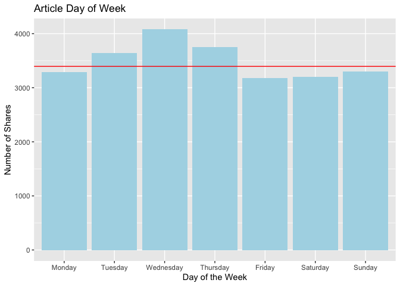
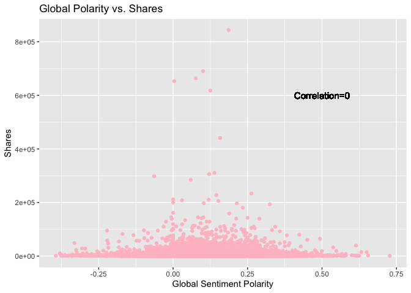
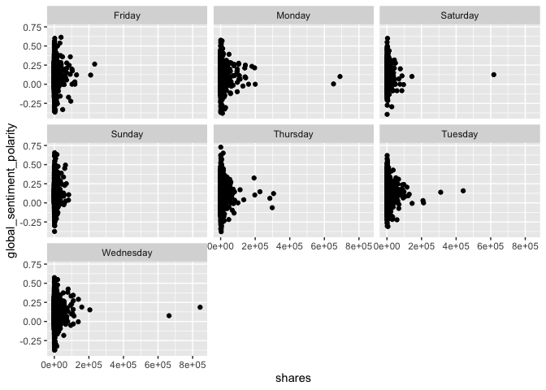
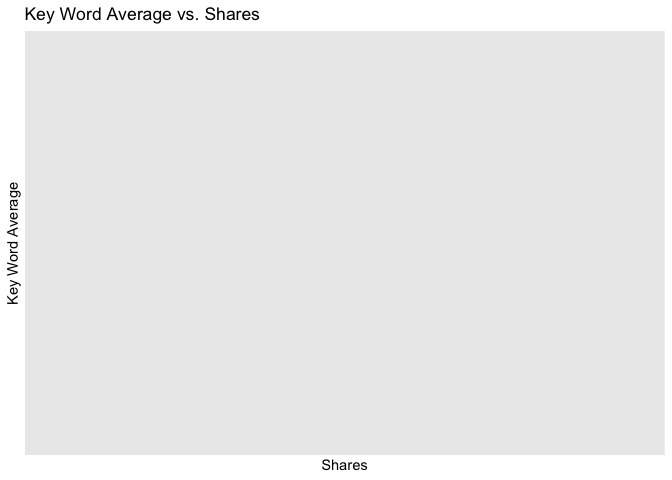

ST558-Project-2
================
Jenna Wilkie
10/22/2021

``` r
library(tidyverse)
library(caret)
library(randomForest)
library(gbm)
library(doParallel)
```

# Intoduction

The data set collected from different articles was published by Mashable
(www.mashable.com) with the last two years. We mainly subset six
different channels: lifestyle, entainment, business, socmed, tech and
world to predict the probability of online news popularity.  
In this project, we summarized and plot some parameters (predictors)
against shares (response). Furthermore, we use four different methods -
two linear models, a random forest and a boosted tree models - to model
the response (shares of articles) from different articles on Mashable
website and predict the popularity of online news.

# Reading in Data Set

To begin, we read in the data set, then created a subset of the data to
look at only the news article type that we are interested in. A variable
named “channel” was added to allow us to automate R markdown documents
based on article type.

``` r
data<-online_news_popularity<-read_csv("OnlineNewsPopularity.csv")

#create new variable for channel then filter for data to select the chanel of interest
data <- data %>%
  mutate(channel= if_else(data_channel_is_bus == 1,"bus",
                          if_else(data_channel_is_lifestyle == 1, "lifestyle",
                          if_else(data_channel_is_entertainment == 1, "entertainment",
                          if_else(data_channel_is_tech == 1, "tech",
                          if_else(data_channel_is_world == 1, "world", "socmed"))))))
```

``` r
data<-filter(data,channel=="entertainment")
```

# Summarizations

Next we will look at some summary statistics of the data.

## Summary Statistics

To start, we want to take a look at some important summary statistics of
the data.

One interesting statistic to look at is the average number of shares
since that is the variable that we will be predicting. Below are the
mean and standard deviation of that column. The mean can tell us the
expected value of the number of shares of each article, and the standard
deviation can tell us how far the observed values vary from the expected
value, on average. A large standard deviation tells us that the data has
a lot of
    variation.

``` r
shares_avg<-mean(data$shares)
```

    ## Warning in mean.default(data$shares): argument is not numeric or logical: returning NA

``` r
shares_sd<-sd(data$shares)

shares_avg
```

    ## [1] NA

``` r
shares_sd
```

    ## [1] NA

Another thing that could be interesting is which day of the week has the
most shares for this type of article and how many shares occur in total
for each day of the week. The averages will give us the expected number
of shares for each day, and the summation will give us a total count of
the number of shares that have occurred overall.

``` r
mon_avg<-data%>%filter(weekday_is_monday == 1)
tue_avg<-data%>%filter(weekday_is_tuesday==1)
wed_avg<-data%>%filter(weekday_is_wednesday==1)
thu_avg<-data%>%filter(weekday_is_thursday==1)
fri_avg<-data%>%filter(weekday_is_friday==1)
sat_avg<-data%>%filter(weekday_is_saturday==1)
sun_avg<-data%>%filter(weekday_is_sunday==1)

mon_sum<-data%>%filter(weekday_is_monday == 1)
tue_sum<-data%>%filter(weekday_is_tuesday==1)
wed_sum<-data%>%filter(weekday_is_wednesday==1)
thu_sum<-data%>%filter(weekday_is_thursday==1)
fri_sum<-data%>%filter(weekday_is_friday==1)
sat_sum<-data%>%filter(weekday_is_saturday==1)
sun_sum<-data%>%filter(weekday_is_sunday==1)

avgs<-data.frame("Avg"=c(mean(mon_avg$shares),mean(tue_avg$shares),mean(wed_avg$shares),mean(thu_avg$shares),mean(fri_avg$shares),mean(sat_avg$shares),mean(sun_avg$shares)), "Day"=c("Mon", "Tues", "Wed", "Thur", "Fri", "Sat", "Sun"))

sums<-data.frame("Value"=c(sum(mon_sum$shares),sum(tue_sum$shares),sum(wed_sum$shares),sum(thu_sum$shares),sum(fri_sum$shares),sum(sat_sum$shares),sum(sun_sum$shares)), "Day"=c("Mon", "Tues", "Wed", "Thur", "Fri", "Sat", "Sun"))

avgs
```

    ##        Avg  Day
    ## 1 2931.036  Mon
    ## 2 2708.033 Tues
    ## 3 2854.619  Wed
    ## 4 2882.213 Thur
    ## 5 3000.947  Fri
    ## 6 3416.400  Sat
    ## 7 3810.951  Sun

``` r
sums
```

    ##     Value  Day
    ## 1 3980347  Mon
    ## 2 3479822 Tues
    ## 3 3696732  Wed
    ## 4 3548004 Thur
    ## 5 2916920  Fri
    ## 6 1298232  Sat
    ## 7 2042670  Sun

We are interested in the impact of global rate positive words and global
rate negative words on shares. Also, we compared with rate positive
words and negative words.

``` r
avg_global_pos <- mean(data$global_rate_positive_words)
var_global_pos  <- sd(data$global_rate_positive_words)
avg_global_pos 
```

    ## [1] 0.04047572

``` r
var_global_pos 
```

    ## [1] 0.01692767

``` r
avg_global_neg  <- mean(data$global_rate_negative_words)
var_global_neg <- sd(data$global_rate_negative_words)
avg_global_neg
```

    ## [1] 0.01905456

``` r
var_global_neg 
```

    ## [1] 0.01252802

``` r
avg_rate_pos <- mean(data$rate_positive_words)
var_rate_pos <- sd(data$rate_positive_words)
avg_rate_pos 
```

    ## [1] 0.6663317

``` r
var_rate_pos 
```

    ## [1] 0.1850866

``` r
avg_rate_neg <- mean(data$rate_negative_words)
var_rate_neg<- sd(data$rate_negative_words)
avg_rate_neg
```

    ## [1] 0.3050442

``` r
var_rate_neg 
```

    ## [1] 0.1546417

We want to inspect impact of number of images and videos on shares of
articles.

``` r
avg_num_imgs <- mean(data$num_imgs)
var_num_imgs <- sd(data$num_imgs)
avg_num_imgs 
```

    ## [1] 6.317699

``` r
var_num_imgs 
```

    ## [1] 11.62707

``` r
avg_num_videos <- mean(data$num_videos)
var_num_videos <- sd(data$num_videos)
avg_num_videos
```

    ## [1] 2.545841

``` r
var_num_videos  
```

    ## [1] 6.225034

## Graphs

We want to see if there is any relation between the number of shares and
the day of the week. A good way to view that data may be to look at a
graphical representation. Below is a bar plot with the average counts
for each day of the week. A solid red bar indicates the total average
number of shares without accounting for date..

``` r
# change the shape of the data for easy graphing.  
ggplot(data=avgs, aes(x=Day, y=Avg))+geom_bar(stat="Identity", fill="light blue")+geom_abline(aes(intercept=shares_avg,slope=0), color="red")+labs(x="Day of the Week", y="Number of Shares", title="Article Day of Week")+scale_x_discrete(labels=c("Monday", "Tuesday", "Wednesday","Thursday", "Friday", "Saturday","Sunday"))
```

    ## Warning: Removed 7 rows containing missing values (geom_abline).

<!-- -->

Another interesting observation regarding the number of shares could
involve the global\_sentiment\_polarity. It is possible that more or
less polarizing articles could show a difference in share rate. Below is
a scatter plot of global\_sentiment\_polarity vs. shares. The
correlation between the two variables in each plot is included. When
evaluating a correlation, a value that is closer to 1 or negative 1
indicates a stronger correlation. A positive correlation means that as
one variable increases so does the other, and a negative correlation
means that as one variable increases, the other decreases. For example,
a correlation of -.77 would be a moderately strong negative correlation.

``` r
correlation<-cor(data$global_sentiment_polarity, data$shares)
ggplot(data, aes(x=global_sentiment_polarity, y=shares))+geom_point(color="pink")+labs(x="Global Sentiment Polarity", y="Shares" ,title="Global Polarity vs. Shares")+geom_text(x=0.5, y=6e+05, size=4 ,label=paste0("Correlation=",round(correlation,2)))
```

<!-- -->

It may also be worth it to look at a facet wrap of polarity against
shares grouped by the day of the week. Each plot shows a scatter plot of
each day of the week with the global\_sentiment\_polarity vs.shares for
that day. In each plot, look for a shape that indicates a straight line.
If the plot appears to resemble a straight line, then that relationship
is linear.

``` r
#create a temporary data set with a variable for the days of the week
data_weeks<-data %>%
  mutate(day=if_else(weekday_is_monday == 1,"Monday",
                          if_else(weekday_is_tuesday == 1, "Tuesday",
                          if_else(weekday_is_wednesday == 1, "Wednesday",
                          if_else(weekday_is_thursday == 1, "Thursday",
                          if_else(weekday_is_friday == 1, "Friday",if_else(weekday_is_saturday==1,"Saturday", "Sunday")))))))

#plot data set grouped by day of week

ggplot(data=data_weeks, aes(x=shares, y=global_sentiment_polarity))+geom_point()+facet_wrap(~day)
```

<!-- -->

We can also look at how keywords can affect the number of shares for an
article. The scatter plot below shows the kw\_avg\_avg plotted against
shares. The correlations that are included on this plot and can be
interpreted in the same way as stated above. If the absolute value of
the correlation is close to 1, there is a strong linear association
between the variables.

``` r
correlation<-cor(data$shares, data$kw_avg_avg)
ggplot(data, aes(x=shares, y=kw_avg_avg))+geom_point(color="#F8766D")+labs(x="Shares", y="Key Word Average" ,title="Key Word Average vs. Shares")+geom_text(x=6e+05, y=40000, size=3 ,label=paste0("Correlation=",round(correlation,2)))
```

<!-- -->

We think the global rate positive words and negative words would have
some impact on shares. So we plot scatter plots. If correlation between
global rate positive words or negative words and shares is small, which
means the global rate positive and negative words barely have influence
on people’s sharing an article. Otherwise, there is a high
correlation.

``` r
correlation_global_pos<-cor(data$global_rate_positive_words, data$shares)
correlation_global_pos
```

    ## [1] -0.01844167

``` r
ggplot(data, aes(x=global_rate_positive_words, y=shares))+geom_point(color="green")+labs(x="global_rate_positive_words", y="Shares" ,title="global_rate_positive_words vs. Shares")+geom_text(x=0.10, y=6e+05, size=4,label = paste0("Correlation =", round(correlation_global_pos,2)))
```

<!-- -->

``` r
correlation_global_neg<-cor(data$global_rate_negative_words, data$shares)
correlation_global_neg
```

    ## [1] -0.01360618

``` r
ggplot(data, aes(x=global_rate_negative_words, y=shares))+geom_point(color="blue")+labs(x="global_rate_negative_words", y="Shares" ,title="global_rate_negative_words vs. Shares")+geom_text(x=0.06, y=6e+05, size=4, label = paste0("Correlation = " , round(correlation_global_neg,2)))
```

<!-- -->

Also, we inspect the impact of rate positive words and negative words on
shares. Based on the result, we can conclude which has higher
correlation with shares, rate negative words or rate positive words.

``` r
correlation_rate_pos<-cor(data$rate_positive_words, data$shares)
correlation_rate_pos
```

    ## [1] 0.005400506

``` r
ggplot(data, aes(x=rate_positive_words, y=shares))+geom_point(color="yellow")+labs(x="rate_positive_words", y="Shares" ,title="rate_positive_words vs. Shares")+geom_text(x=0.22, y=7e+05, size=4,label = paste0("Correlation =", round(correlation_rate_pos,2)))
```

<!-- -->

``` r
correlation_rate_neg<-cor(data$rate_negative_words, data$shares)
correlation_rate_neg
```

    ## [1] -0.006778685

``` r
ggplot(data, aes(x=rate_negative_words, y=shares))+geom_point(color="orange")+labs(x="rate_negative_words", y="Shares" ,title="rate_negative_words vs. Shares")+geom_text(x=0.22, y=7e+05, size=4,label = paste0("Correlation =", round(correlation_rate_neg,2)))
```

<!-- -->

We are interested in influence of number of images and videos on shares.
Based on result, we may see the relationship between number of images or
videos and shares of articles, whether shares went up with increase of
number of images or videos or not.

``` r
correlation_imgs<-cor(data$num_imgs, data$shares)
correlation_imgs
```

    ## [1] 0.03809298

``` r
ggplot(data, aes(x=num_imgs, y=shares))+geom_point(color="red")+labs(x="num_imgs", y="Shares" ,title="num_imgs vs. Shares")+geom_text(x=40, y=7e+05, size=4,label = paste0("Correlation =", round(correlation_imgs,2)))
```

<!-- -->

``` r
correlation_videos<-cor(data$num_videos, data$shares)
correlation_videos
```

    ## [1] -0.0005863698

``` r
ggplot(data, aes(x=num_videos, y=shares))+geom_point(color="purple")+labs(x="num_videos", y="Shares" ,title="num_videos vs. Shares")+geom_text(x=60, y=7e+05, size=4,label = paste0("Correlation =", round(correlation_videos,2)))
```

<!-- -->

# Modeling

Based on the trends above, and common knowledge, we will fit a two
linear models, a random forest model, and a boosted tree model for
comparison.

The first step is to split the data into a training and test set using
the **caret** package and convert the shares variable to a factor.

``` r
# set seed for reproduceability
set.seed(89)

train_index<-createDataPartition(data$shares, p=0.7, list=FALSE)
training<-data[train_index,]
test<-data[-train_index,]
```

Now each of the models will be fitted using the training data set and
analyzed through 5 fold cross validation. The test set will be used for
prediction.

## Linear Regression Models

A linear regression model allows us to predict the response of a
variable of interest, in this case the **shares** variable, based on a
selected set of predictors. A simple linear regression model can be
written as y=Beta\_0+Beta\_1\*x, where Beta\_0 is the intercept, Beta\_1
is the slope, x is the predictor variable, and y is the response.
Multiple linear regression models can be used in instances where
multiple possible predictors are present. In those cases there will be a
slope for each predictor to account for the effect that predictor can
have on the response.

``` r
set.seed(89)

linear_fit_1 <- train(shares~self_reference_avg_sharess+abs_title_sentiment_polarity+abs_title_subjectivity+avg_positive_polarity+avg_negative_polarity+is_weekend+rate_positive_words+rate_negative_words, data=training, method = "lm", trControl=trainControl(method="cv", number=5),preProcess = c("center", "scale"))

linear_fit_1
```

    ## Linear Regression 
    ## 
    ## 27752 samples
    ##     8 predictor
    ## 
    ## Pre-processing: centered (8), scaled (8) 
    ## Resampling: Cross-Validated (5 fold) 
    ## Summary of sample sizes: 22203, 22202, 22200, 22201, 22202 
    ## Resampling results:
    ## 
    ##   RMSE      Rsquared     MAE     
    ##   12462.96  0.008687016  3244.273
    ## 
    ## Tuning parameter 'intercept' was held constant at a value of TRUE

``` r
set.seed(89)

linear_fit_2 <- train(shares~global_rate_negative_words+num_imgs+ global_rate_negative_words:num_imgs+I(global_rate_negative_words^2)+I(num_imgs^2), data=training, method = "lm", trControl=trainControl(method="cv", number=5),preProcess = c("center", "scale"))

linear_fit_2
```

    ## Linear Regression 
    ## 
    ## 27752 samples
    ##     2 predictor
    ## 
    ## Pre-processing: centered (5), scaled (5) 
    ## Resampling: Cross-Validated (5 fold) 
    ## Summary of sample sizes: 22203, 22202, 22200, 22201, 22202 
    ## Resampling results:
    ## 
    ##   RMSE      Rsquared     MAE     
    ##   12485.79  0.003090796  3272.609
    ## 
    ## Tuning parameter 'intercept' was held constant at a value of TRUE

## Ensemble Models

### Random Forest Model

A random forest model creates multiple trees from bootstrap analysis
then averages the results. Random forest models randomly select a subset
of predictors for averaging, so the results won’t be affected by one or
two very strong predictors. Below is a random forest model fitted from
the data. The model self reference shares, absolute title sentiment
polarity, absolute title subjectivity, average positive polarity,
average negative polarity, rate positive words, and rate negative words
as predictors.

``` r
set.seed(89)

#use parallel computing to speed up process on four cores
cl <- makePSOCKcluster(4)
registerDoParallel(cl)

random_forest_fit <- train(shares~self_reference_avg_sharess+abs_title_sentiment_polarity+abs_title_subjectivity+avg_positive_polarity+avg_negative_polarity+is_weekend+rate_positive_words+rate_negative_words, data=training, method = "rf", trControl=trainControl(method="cv", number=10),preProcess = c("center", "scale"), tuneGrid=data.frame(mtry=(1:6)))


random_forest_fit
```

    ## Random Forest 
    ## 
    ## 27752 samples
    ##     8 predictor
    ## 
    ## Pre-processing: centered (8), scaled (8) 
    ## Resampling: Cross-Validated (10 fold) 
    ## Summary of sample sizes: 24976, 24976, 24977, 24977, 24978, 24978, ... 
    ## Resampling results across tuning parameters:
    ## 
    ##   mtry  RMSE      Rsquared    MAE     
    ##   1     11660.63  0.01229076  3222.518
    ##   2     11743.53  0.01263793  3343.923
    ##   3     11791.54  0.01219872  3404.916
    ##   4     11846.20  0.01128787  3438.336
    ##   5     11880.50  0.01179980  3463.737
    ##   6     11942.62  0.01105469  3492.156
    ## 
    ## RMSE was used to select the optimal model using the smallest value.
    ## The final value used for the model was mtry = 1.

### Boosted Tree Model

A boosted tree model was created. Ensemble boosting tree approach can be
applied to make trees grown sequentially, each subsequent tree grown on
a modified version of original data (slow fitting because of shrinkage),
and predictions updated as trees grown. Because the tree grown was
shrink for slow fitting, so the appropriate interpretation of trees was
lost.

``` r
set.seed(89)
#create cores for parallel computing
cl <- makePSOCKcluster(4)
registerDoParallel(cl)

boosted_tree_fit <-
  train(shares ~ self_reference_avg_sharess+weekday_is_tuesday+weekday_is_wednesday+weekday_is_thursday+weekday_is_friday+global_rate_positive_words+global_rate_negative_words+num_imgs+num_videos, data=training, method = "gbm", trControl=trainControl(method="cv", number=5),preProcess = c("center", "scale"), tuneGrid=expand.grid(n.trees=c(10,20,50,100,200), interaction.depth = c(1,2,3,4), shrinkage = 0.1, n.minobsinnode = 10))
```

    ## Iter   TrainDeviance   ValidDeviance   StepSize   Improve
    ##      1 164395755.1694             nan     0.1000 277992.0760
    ##      2 164081519.3895             nan     0.1000 248109.0152
    ##      3 163892156.0244             nan     0.1000 119132.8466
    ##      4 163541514.0149             nan     0.1000 -35897.7888
    ##      5 163303913.5730             nan     0.1000 156051.6607
    ##      6 163182724.8094             nan     0.1000 64174.1604
    ##      7 162994663.2026             nan     0.1000 84671.6916
    ##      8 162839641.2241             nan     0.1000 144172.8149
    ##      9 162690225.1047             nan     0.1000 45262.6839
    ##     10 162579872.1356             nan     0.1000 90903.7102
    ##     20 161034363.8965             nan     0.1000 -104163.8007
    ##     40 159483993.1381             nan     0.1000 82669.1234
    ##     50 158886531.6796             nan     0.1000 -56450.5507

``` r
boosted_tree_fit
```

    ## Stochastic Gradient Boosting 
    ## 
    ## 27752 samples
    ##     9 predictor
    ## 
    ## Pre-processing: centered (9), scaled (9) 
    ## Resampling: Cross-Validated (5 fold) 
    ## Summary of sample sizes: 22203, 22202, 22200, 22201, 22202 
    ## Resampling results across tuning parameters:
    ## 
    ##   interaction.depth  n.trees  RMSE      Rsquared     MAE     
    ##   1                   10      12463.48  0.006948351  3244.519
    ##   1                   20      12457.67  0.007637148  3237.552
    ##   1                   50      12442.76  0.010156878  3226.346
    ##   1                  100      12436.55  0.011149324  3216.233
    ##   1                  200      12442.69  0.011338251  3204.773
    ##   2                   10      12454.31  0.008375172  3241.372
    ##   2                   20      12450.22  0.009219253  3233.833
    ##   2                   50      12428.75  0.013967349  3211.861
    ##   2                  100      12441.57  0.013702017  3209.140
    ##   2                  200      12487.97  0.011462707  3227.419
    ##   3                   10      12458.40  0.007911853  3224.623
    ##   3                   20      12439.78  0.011567228  3208.762
    ##   3                   50      12445.87  0.012689331  3211.800
    ##   3                  100      12494.21  0.010222982  3223.226
    ##   3                  200      12581.67  0.008383590  3255.174
    ##   4                   10      12459.97  0.008546346  3243.460
    ##   4                   20      12448.51  0.012317254  3229.038
    ##   4                   50      12475.94  0.011630247  3226.589
    ##   4                  100      12571.65  0.007942468  3252.528
    ##   4                  200      12685.35  0.006920598  3299.978
    ## 
    ## Tuning parameter 'shrinkage' was held constant at a value of 0.1
    ## Tuning parameter 'n.minobsinnode' was held constant
    ##  at a value of 10
    ## RMSE was used to select the optimal model using the smallest value.
    ## The final values used for the model were n.trees = 50, interaction.depth = 2, shrinkage = 0.1 and n.minobsinnode = 10.

# Compairson

Now that all of the models are created and chosen using cross
validation, we can use the **predict** function on the test set to find
the best predictor from our chosen models on the test set.

``` r
set.seed(89)
pred_linear_1<-predict(linear_fit_1, test)
pred_linear_2<-predict(linear_fit_2, test)
pred_random_fit<-predict(random_forest_fit, test)
pred_boosted_fit<-predict(boosted_tree_fit, test)
linear_1<-postResample(pred_linear_1,test$shares)
linear_2<-postResample(pred_linear_2,test$shares)
random_fit<-postResample(random_forest_fit$bestTune,test$shares)
boosted_fit<-postResample(boosted_tree_fit$bestTune,test$shares)

results<-data.frame("Model"=c("Linear Model 1", "Linear Model 2", "Random Forest Model", "Boosted Tree Model"),"RMSE"=c(linear_1[1],linear_2[1],random_fit[1],boosted_fit[1]))
```

``` r
#Find the minimum RMSE value
min_rmse<-min(results$RMSE)

#use a for loop to find the index of the minimum rmse value and use that index to return the linear model associated with that rmse.
for(i in 1:4){
  if (results[i,2]==min_rmse){
  model<-results[i,1]
  }
}
```

``` r
#paste the automated result

paste0("The best predictor model of the ones we've created was selected by choosing the model with the lowest RMSE value.  For this type of article, the best model is ", model,".")
```

    ## [1] "The best predictor model of the ones we've created was selected by choosing the model with the lowest RMSE value.  For this type of article, the best model is Linear Model 2."
